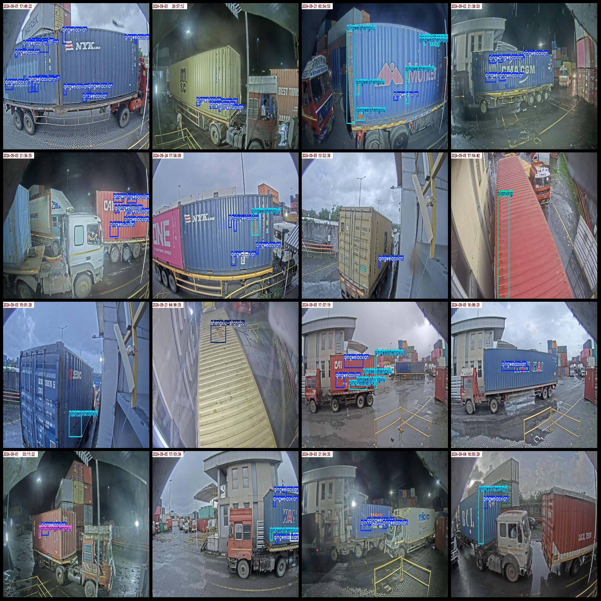
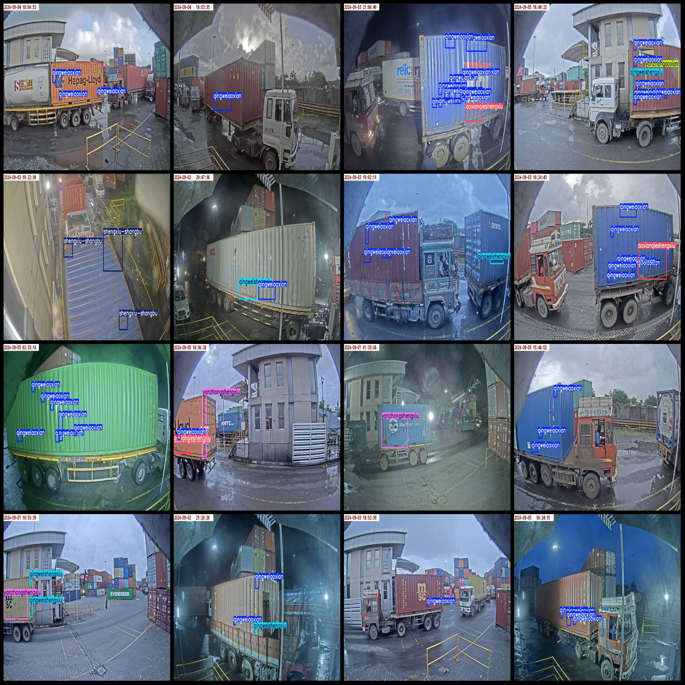

# Container Surface Defects Detection Dataset VOC+YOLO Format with 9600 Images in 12 Categories

Dataset format: Pascal VOC format + YOLO format (without split paths in txt files, only containing jpg images and corresponding VOC format xml files and yolo format txt files)
Number of images (jpg file counts): 9600
Number of annotations (xml file counts): 9600
Number of annotations (txt file counts): 9600
Number of annotation categories: 12
Annotation category names (note that the order of labels in the yolo format does not correspond to this, but is based on the "labels" folder's "classes.txt"): ["aoxianqieshengxiu", "bianxing", 
"jiaozhuqiekou", "liefeng", "qingweiaoxian", "qingweishengxiu", "qita", "shengxiu-houmen", "shengxiu-qianbu", "shengxiu-shangbu", "yanzhongaoxian", "yanzhongshengxiu"]
["Cavity with rust", "Deformation", "Corner pillar cut", "Crack", "Mild indentation", "Mild rust", "Other", "Rust - Rear Door", "Rust - Front", "Rust - Upper", "Severe Cavity", "Severe Rust"]
Box count per category:
- aoxianqieshengxiu box count = 755
- bianxing box count = 342
- jiaozhuqiekou box count = 2
- liefeng box count = 137
- qingweiaoxian box count = 23491
- qingweishengxiu box count = 6710
- qita box count = 1463
- shengxiu-houmen box count = 480
- shengxiu-qianbu box count = 681
- shengxiu-shangbu box count = 1962
- yanzhongaoxian box count = 466
- yanzhongshengxiu box count = 1061
Total box count: 37550
Number of images each category owns:
- aoxianqieshengxiu owns images = 550
- bianxing owns images = 235
- jiaozhuqiekou owns images = 2
- liefeng owns images = 94
- qingweiaoxian owns images = 6471
- qingweishengxiu owns images = 2799
- qita owns images = 958
- shengxiu-houmen owns images = 194
- shengxiu-qianbu owns images = 319
- shengxiu-shangbu owns images = 903
- yanzhongaoxian owns images = 413
- yanzhongshengxiu owns images = 699
Image resolution: 1280x720
Annotation tool used: labelImg
Annotation rules: draw boxes around categories
Important note: The dataset does not have been divided into training, validation, or test sets; you need to do so yourself.
Special declaration: This dataset does not guarantee the accuracy of models trained on it or the weights files.
Image preview:
## Images

Here is a pay link on Stripe ( https://buy.stripe.com/3cs8yP7sY87d0vu9AB ). Please contact me lonlonago@foxmail.com after funding $89, and I will send you a complete data files , thank you!

